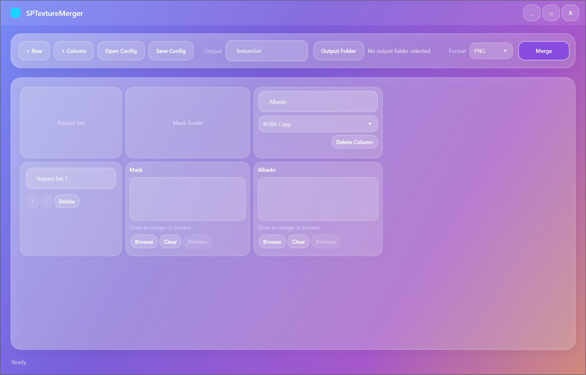

# SPTextureMerger

SPTextureMerger merges maps exported from multiple Substance 3D Painter Texture Sets into one UV set.

It uses a mask guide for each row. The mask decides which pixels from that Texture Set are copied into the final maps.



## Download

Use one of the GitHub Release builds:

- `SPTextureMerger-win-x64.zip` - small build, needs .NET 8 Desktop Runtime. Extract it first, then run `SPTextureMerger.exe`.
- `SPTextureMerger-win-x64-self-contained.exe` - single-file build, no runtime install needed.

## Use It

1. Click `+ Row` for each Texture Set you want to merge.
2. Drop the mask guide into the `Mask` slot.
3. Click `+ Column` for each output map: Albedo, Normal, Roughness, whatever.
4. Drop each Texture Set's matching map into the right slot.
5. Pick a merge behavior:
   - `RGBA Copy` for Base Color, Albedo, Emissive, UI-ish color maps.
   - `Normal Replace Normalize` for tangent-space normal maps.
   - `Data Copy` for Roughness, Metallic, AO, packed masks, and other data maps.
6. Set the output name and folder.
7. Click `Merge`.

Rows lower in the list override rows above them if masks overlap. Use the arrow buttons to reorder rows.

Existing output files are overwritten. No confirmation dialog, so check the folder before you hit `Merge`.

## Make The Mask In Substance 3D Painter

Do this for every Texture Set you want to merge.

1. Open `Texture Set Settings`.
2. In `Channels`, add the same `User Channel`, for example `User0`.
3. In the `Layer Stack`, add a `Fill Layer`.
4. Disable every channel on that Fill Layer except `User0`.
5. Set `User0` to white.
6. If only part of the Texture Set should be merged, add a black mask to that Fill Layer and paint the wanted area white.
7. In your export preset's `Output Templates`, add one new `RGB+A` output map.
8. From `Input maps`, drag `user0` into the RGB slots, then drag `user0` into A as grayscale.
9. Export as PNG.
10. Set padding to `Dilation + transparent`.

The result should be a transparent PNG with the Texture Set's UV island area in white. That is the mask guide.

Keep the mask and all maps at the same resolution. This app rejects mixed sizes because silent resizing is how texture bugs get sneaky.

## Config Files

`Open Config` and `Save Config` store the row/column setup as JSON.

Paths are saved relative to the config file when possible.

## Build

```powershell
dotnet build SPTextureMerger.sln
dotnet run --project src/SPTextureMerger/SPTextureMerger.csproj
```

Run the lightweight tests:

```powershell
dotnet run --project tests/SPTextureMerger.Tests/SPTextureMerger.Tests.csproj
```

Publish:

```powershell
dotnet publish src/SPTextureMerger/SPTextureMerger.csproj -c Release -r win-x64 --self-contained false -o publish/win-x64
dotnet publish src/SPTextureMerger/SPTextureMerger.csproj -c Release -r win-x64 --self-contained true -p:PublishSingleFile=true -p:PublishTrimmed=false -p:IncludeNativeLibrariesForSelfExtract=true -o publish/win-x64-self-contained
```

## License

MIT.
